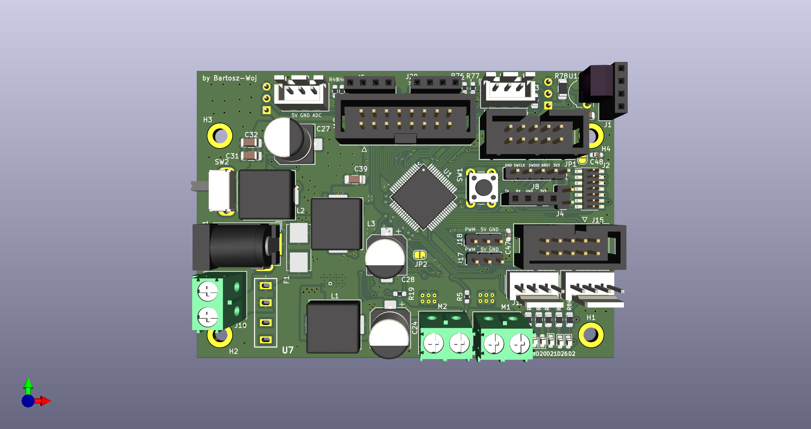
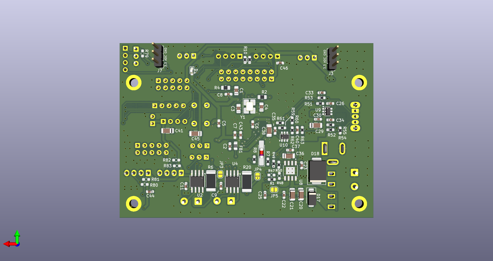
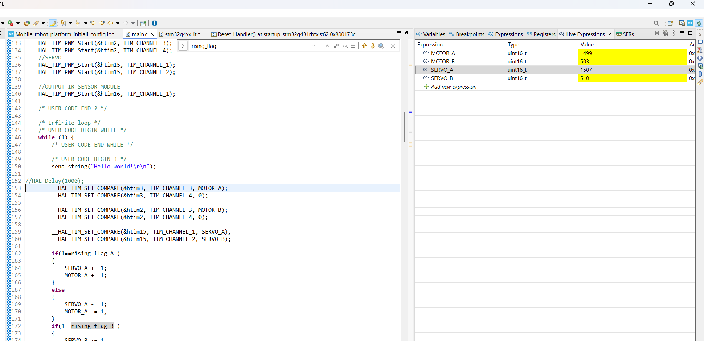

# Mobile robot hardware platform

## Project Description

**Universal PCB** with STM32G431 with two 2 h-bridges and input/output connectors designed for usage as mobile robot mainboard. The PCB can be use as mainboard for mini sumo robot, balancing robot, linefollower and other similar projects.

## Main functionality

- STM32G431
- IR receiver
- power lines: 3V3, 5V, 6V5 with step-down converters.
- switch for enabling/disabling power lines
- 2x i2C connector
- 2x servo connector
- 2x encoder connector
- 2x H-bridge (3.6A each)
- 2x 10pin IDC connector
- 1x 16pin IDC connector (for IR distance sensor)
- connector for IR sumo [robot start module](https://p1r.se/startmodule/)

## Program uploading and debugging

The ST-link can be connected to the J2 connector by IDC wire to [ST-Link Nucleo board programming shield] (https://github.com/Bartosz-Woj/ST_LINK-Nucleo-programming-shield) or to the connector J6 by goldpin wires.

## Software

In the folder /software there are example projects made in STM32CubeIDE which can be used for hardware testing and for initial configuration:

- initial_configuration - project with initial configuration of CubeMX. In the main function there is code for testing PWM.

## Project status

- electronic desing: finished
- example usage design: on going

## Additional modules

- [ST-Link Nucleo board programming shield](https://github.com/Bartosz-Woj/ST_LINK-Nucleo-programming-shield)
- [Modulated infrared distance sensor module which peak detection](https://github.com/Bartosz-Woj/Modulated_infrared_distance_sensor)

## Usage in mobile robot projects

on going

## Photos

- **PCB top side:**  
  
- **PCB bottom side:**  
  

- **Debuging mode:**  
  

- **Example connection with motors**  
  

---

## Author

- **Project by:** Bartosz-Woj (Bartosz Wojciechowski)
- **Date:** 10.11.2025

---

## License

Licensed under the **CERN Open Hardware License v2 – Permissive (CERN-OHL-P)**  
You are free to **use, modify, and redistribute** this project, provided that you **credit the original author**.
